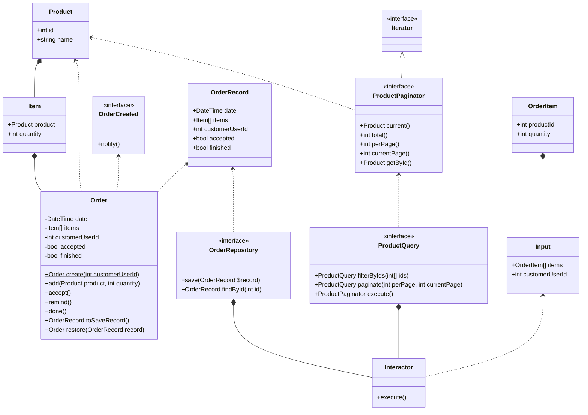

```
docker run \
  --volume `pwd`:`pwd` \
  --workdir `pwd` \
  php:8.1.13-zts-alpine3.17 \
  php vendor/bin/phpunit
```


```mermaid
classDiagram
    Item *-- Order
    Product *-- Item
    Product <.. Order
    OrderCreated <.. Order
    OrderRecord <.. Order
    class Product{
      +int id
      +string name
    }
    class Item{
      +Product product
      +int quantity
    }
    class Order{
      -DateTime date
      -Item[] items
      -int customerUserId
      -bool accepted
      -bool finished

      +Order create(int customerUserId)$
      +add(Product product, int quantity)
      +accept()
      +remind()
      +done()
      +OrderRecord toSaveRecord()
      +Order restore(OrderRecord record)
    }
    class OrderCreated{
      <<interface>>
      +notify()
    }
    class OrderRecord{
      +DateTime date
      +Item[] items
      +int customerUserId
      +bool accepted
      +bool finished
    }
    
    OrderRepository *-- Interactor
    OrderRecord <.. OrderRepository
    ProductQuery *-- Interactor
    Input <.. Interactor
    OrderItem *-- Input
    ProductPaginator <.. ProductQuery
    Product <.. ProductPaginator
    Iterator <|-- ProductPaginator
    class Interactor{
      +execute()
    }
    class Input{
      +OrderItem[] items
      +int customerUserId
    }
    class OrderItem{
      +int productId
      +int quantity
    }
    class OrderRepository{
      <<interface>>
      +save(OrderRecord $record)
      +OrderRecord findById(int id) 
    }
    class ProductQuery{
      <<interface>>
      +ProductQuery filterByIds(int[] ids)
      +ProductQuery paginate(int perPage, int currentPage)
      +ProductPaginator execute()
    }
    class ProductPaginator{
      <<interface>>
      +Product current()
      +int total()
      +int perPage()
      +int currentPage()
      +Product getById()
    }
    class Iterator{
      <<interface>>
    }
```
